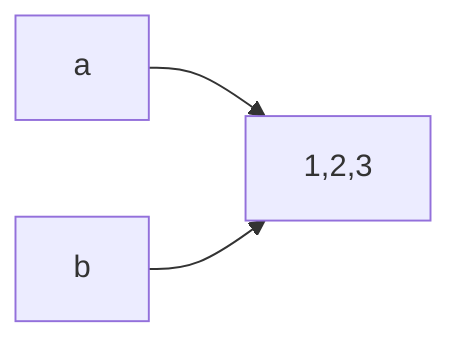

# 深拷贝与浅拷贝

# 直接赋值

其实就是对象的引用（别名）。

​`a=[1,2,3]; b=a`​a与b享有相同的内存空间，指向同一个内存地址，

使用`a.append()`​添加元素后，b也会随之改变。

# 浅拷贝(copy)

拷贝父对象，不会拷贝对象的内部的子对象。

- ​`a.copy()`​与`copy.copy()`​结果一致；元组没有a.copy()方法；总之，当拷贝内容为不可变对象时，内存地址相同；当拷贝内容为可变对象时，内存地址不同。
- ​`a=[1,2]; b=a.copy()`​ a与b内存空间不同，a添加元素，不会改变b的值
- ​`a=[1,2]; b=[3,4]; c=(a,b); d=copy.copy(c)`​​ c与d内存空间相同，a添加元素，c与d的值都会改变  
  ​​
- ​`a=[1,2]; b=[3,4]; c=[a,b]; d=c.copy()`​copy对列表和元组的处理结果不同，c与d内存空间不同，c添加元素不会改变d的值， 但是如果是a添加元素，c与d的值都会改变​

# 深拷贝(deepcopy)

copy 模块的 deepcopy 方法，完全拷贝了父对象及其子对象。

|类型|列表、字典|数字、字符串|
| ------------------| --------------------------------------| ----------------|
|浅拷贝copy()|拷贝父对象，不会拷贝对象内部的子对象|等同于赋值操作|
|深拷贝deepcopy()|完全拷贝父对象及其子对象|等同于赋值操作|

# 再次对比

​

‍

​

‍
